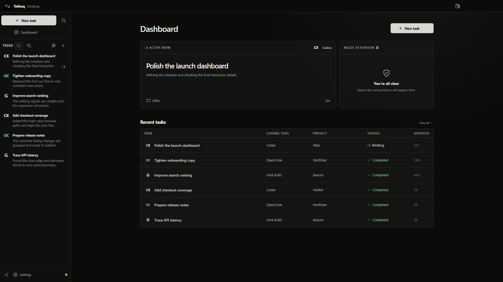
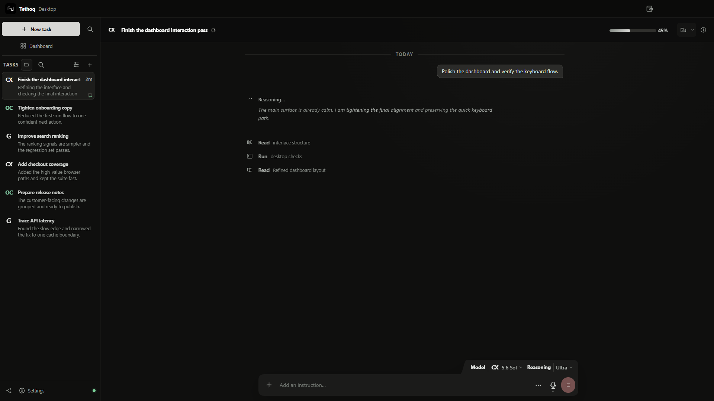
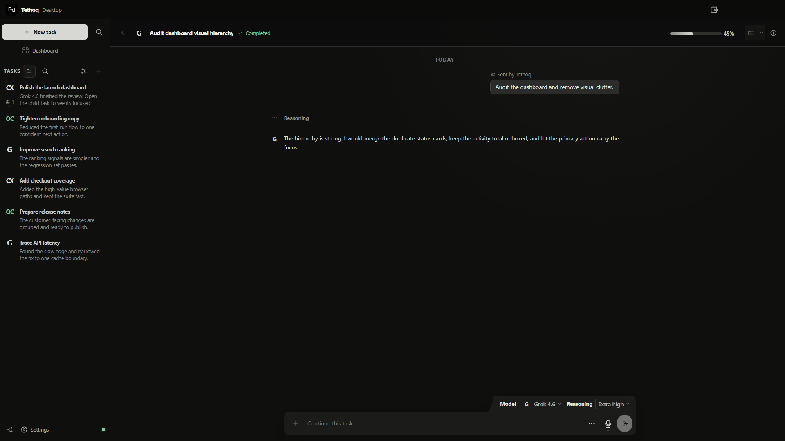
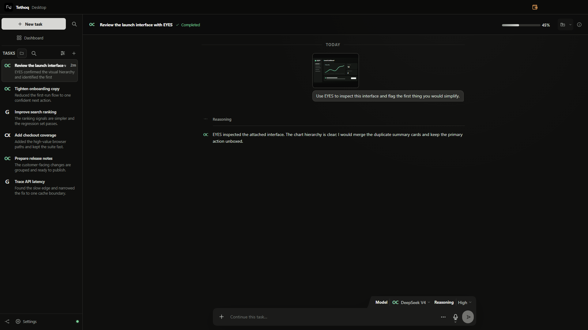

# Tethoq

A provider-neutral remote control for coding-agent sessions. The host-side
bridge detects supported harnesses installed on the computer; the desktop and
Flutter clients can then select their sessions, stream work, send follow-up
instructions, handle exact approvals/user-input requests, and reconnect
through either a direct WebSocket or an outbound relay.

## Product views



| Live coding workspace | Delegated model review |
| --- | --- |
|  |  |
| One task view for conversation, reasoning, tool activity, context, and follow-up work. | Provider-neutral delegation keeps the child task and its result connected to the parent. |



All product images use fictional projects, paths, and conversations generated by the isolated promo fixture; no live user sessions or provider data are present.

This repository is a working implementation, not a design-only scaffold. The
TypeScript bridge, relay, shared protocol, twelve built-in compatibility
entries, fake provider, fixtures, and Node integration tests execute in this
environment. Default adapter tests use deterministic protocol peers or
injected HTTP; opt-in live-provider checks are kept separate.

## What is implemented

- Versioned JSON bridge protocol with runtime validation and a published JSON Schema.
- Globally collision-safe session IDs: encoded `host/provider/native-session` components.
- Capability-driven provider contract; unsupported features are not simulated.
- Built-in adapters for Codex App Server, OpenCode HTTP/SSE, Pi/OMP RPC, and
  ACP modes exposed by Grok Build, Qwen Code, goose, Kimi Code, Hermes Agent,
  Cline, and GitHub Copilot CLI, plus a Direct API adapter for user-supplied
  keys and documented HTTPS model endpoints.
- Provider/API-reported context and token display, provider-reported harness
  cost plus clearly local Direct API spend accounting, safe per-session
  automatic compaction thresholds, and an explicit confirmation before a
  newly lowered threshold causes immediate compaction.
- Fresh context handoffs with a visible 100-1000 word summary, native-or-
  transcript conversation branches, and restart-local transfer continuity.
- Searchable provider-grouped model selection with five recent models,
  endpoint-aware wallet state, and expandable inline image history on Desktop
  and mobile.
- Session-isolated semantic browser tools plus an optional visual-support
  model for text-only primary models.
- A high-volume fake adapter with 175 sessions, pagination, streaming, approvals, user input, failures, duplicate/out-of-order events, interruption, and offline transitions.
- Complete paginated refresh with cache reconciliation and partial-provider failure preservation.
- Normalized live event stream, bounded replay, event deduplication, request IDs, and retry-safe message submission.
- Ed25519 device pairing, host-signed device credentials, short-lived signed actions, replay prevention, revocation, and persisted pairing state.
- Direct WebSocket server, outbound relay client, and a relay with heartbeat, size limits, rate limits, room authentication, and host-offline notification.
- Flutter screens and state for pairing, sessions/filtering, timelines, new sessions, approvals, requested input, interruption, host/provider management, secure storage, and reconnect.

See [BUILD_STATUS.md](docs/BUILD_STATUS.md) for exact status and
[TESTING.md](docs/TESTING.md) for reproducible verification.

## Repository map

```text
apps/
  agent_bridge/       Host process, refresh/cache, pairing, request routing, transports
  desktop_harness/    Windows coding workspace, in-app Chromium, workflow recorder
  remote_client/      Flutter client source and tests
services/
  relay/              Outbound host/device WebSocket relay
packages/
  connector_sdk/      Public MIT connector protocol, SDK, schema, and example
  protocol/           Normalized models, wire envelopes, security, replay/backoff
  provider_contract/  Adapter contract and JSON-RPC/process helpers
  provider_codex/     Codex App Server adapter
  provider_opencode/  OpenCode HTTP/OpenAPI + SSE adapter
  provider_grok/      Shared ACP adapter and Grok/Qwen/goose/Kimi/Hermes/Cline/Copilot presets
  provider_pi/        Pi and OMP native RPC adapters
  provider_direct/    User-key Responses/Chat Completions API adapter
  provider_fake/      Deterministic simulation adapter
  transport_ws/       Dependency-free RFC 6455 server implementation
docs/                 Architecture, research, security, testing, and decisions
```

This monorepo contains the native Windows workspace, Bridge, relay, Flutter
client, website, shared packages, and supporting documentation. Connector
authors can add providers and model-picker entries using only the deliberately
isolated `packages/connector_sdk`; they do not need to depend on Electron or
the Desktop implementation. See
[Desktop connectors](docs/DESKTOP_CONNECTORS.md).

## Windows desktop app

From a fresh clone on Windows with Node.js 22.13 or newer:

```powershell
npm run setup:desktop
npm start
```

Install and sign in to your preferred coding harness separately. Tethoq
attempts the connections automatically. **Settings > Harness connections**
provides installation guides, retries and copyable setup prompts for every
built-in and for **Other harness**. See [Harness setup](docs/HARNESS_SETUP.md).

Tethoq Desktop is the complete Windows coding harness. It ships compatibility
for Codex, OpenCode, Grok Build, Pi, OMP, Qwen Code, goose, Kimi Code, Hermes
Agent, Cline, and GitHub Copilot CLI. It also includes the aggregate Direct API
provider for user-supplied keys, plus the local Bridge, an in-app Chromium
workspace, and opt-in workflow recording. A compatible CLI becomes selectable
when its documented executable or endpoint is available on the host; direct
models become usable only after the corresponding API key is configured.
Tethoq does not bundle those provider executables or include a Claude Code
integration in this release. GitHub Copilot CLI's ACP surface is public preview
and remains capability-gated. Independent connectors remain outside built-in
support.

The browser uses the dedicated persistent Electron partition
`persist:tethoq-browser`. A user can sign into sites manually and keep that
app-owned session between launches, but Tethoq never reads, imports, or
automatically signs into an existing Chrome/Chromium profile. Browser cookies,
cache, authentication, permission choices, and navigation history can be
cleared from the app. Site permissions are denied unless they pass the
browser's allowlist and the user explicitly approves the origin-scoped prompt;
screen capture, HID, serial, USB, Bluetooth, insecure navigation, certificate
exceptions, and HTTP-auth prompts are blocked. Downloads go to the normal
Windows Downloads folder and have pause, resume, cancel, and history controls.

Workflow recording is Windows-only and completely dormant while idle: the
native global input module is not loaded and hooks are not started until the
user presses **Record**. It stores global mouse positions, clicks, sampled drag
paths, key codes/modifiers (not reconstructed text), wall-clock and monotonic
timestamps, best-effort foreground/window/UI context, synchronized full-screen
JPEGs, 640x480 cursor crops, and drag-summary crops. **Stop** tears down the
input hook and unregisters the panic shortcut; `Ctrl+Shift+F12` is available as
a global panic stop when Windows accepts the registration.

Recordings are local under `%USERPROFILE%\Documents\Tethoq\Workflows`. Each
workflow contains `workflow.json`, chronological `events.ndjson`,
`screens/full`, `screens/cursor`, and `screens/drag-summary`. A stopped capture
is staged until the user names and saves it or discards it. A saved workflow can
be referenced from chat, which passes local manifest/event paths to the chosen
harness; Tethoq does not upload workflow data automatically.

Instant sessions are a lightweight, experimental companion: enable them under
**Settings > Experimental features**, then start one from the task composer.
While it runs, spoken utterances are transcribed and sent to the selected
coding tool with time-aligned screen frames, pointer coordinates, and hover
context; text-only models receive a compact description from the user-selected
visual-support model. The feature is fully dormant while the experimental
toggle is off — no microphone or screen permission is requested.

Screen pixels, window titles, browser URLs, file names, element labels, and key
identities may contain secrets. Password-field detection and drag/file semantic
identification are best effort, and protected, elevated, DRM, or accelerated
windows can be blank or incomplete. Review the local folder before sharing it.

See [Tethoq Desktop](apps/desktop_harness/README.md) for development, packaging,
browser, recorder, and security details.

## Desktop and Bridge distribution

Build the Windows Desktop installer from the desktop folder:

```powershell
cd apps\desktop_harness
npm ci
npm run pack:win
```

`pack:win` builds the public connector author kit and Bridge first, then writes
`release\Tethoq-Desktop-<version>-x64.exe`. The installed app includes the same
compact, independently owned Bridge tray application offered by the separate
Bridge download, so Desktop users do not need another installer. Closing
Desktop does not stop Bridge. Desktop does not silently start a second Bridge
runtime while its current provider/connector ownership migration is pending.

To build the standalone Windows x64 Bridge installer from the repository root:

```powershell
npm ci
npm run release:bridge:win
```

That command builds and smoke-checks the compact Bridge application and engine
under `artifacts\releases\bridge`. The public artifact is the NSIS Bridge
installer, which contains the tray companion, a pinned Node.js runtime,
cloudflared, production dependencies, and licenses. A separate
`Tethoq-Bridge-Engine-*.zip` is emitted for advanced diagnostics; it has the
engine launchers but not the Electron tray UI. `release-manifest.json` and
`SHA256SUMS.txt` are emitted beside the artifacts. Publish the installer and
checksum files on an artifact host, then configure the website's direct HTTPS
Desktop, Bridge, and checksum URLs as documented in `apps/web/.env.example`;
the site intentionally disables any download whose real release URL is absent.

## Prerequisites

- Node.js 22.13.0 or newer.
- npm 10 or newer.
- One or more provider installations or direct-model API keys on the host for
  real integration.
- Flutter stable for the mobile/desktop client.

The Node build has only two development packages: TypeScript and Node type declarations. Production code intentionally avoids a third-party WebSocket dependency.

## Install and verify Node code

```bash
npm ci
npm run verify
```

`npm run verify` performs strict TypeScript checking, builds the repository, executes every compiled Node test, and runs the repository quality scan.

Two Codex opt-in integration tests (packages/provider_codex/src/local_integration.test.ts and apps/agent_bridge/src/local_codex_integration.test.ts) are skipped unless TETHOQ_CODEX_INTEGRATION=1. They exercise the installed Codex App Server; the bridge slice sends one trivial instruction and deletes its scratch thread. See docs/TESTING.md.

Useful commands:

```bash
npm run build
npm test
npm run quality
npm run start:bridge -- --help
```

## Pair a physical Android phone

Build the bridge, then start one local-only bridge with a temporary encrypted
phone tunnel. Tethoq opens a localhost pairing page in the computer's default
browser and also prints a terminal QR as a fallback:

```bash
npm run build
npm run phone:pair
```

The phone scans the expiring QR and connects immediately. It contains a
one-time pairing secret, the host public-key fingerprint, and its confirmation
code, and is consumed after a successful pairing. `--phone-pair` requires
`cloudflared` and keeps the bridge listener bound to localhost; the temporary
tunnel closes when the bridge exits. The browser page uses a separate
loopback-only listener, is never exposed through the phone tunnel, and expires
with the pairing code. Pass `--no-open` to suppress automatic browser launch.

## Run the fake vertical slice over direct WebSocket

Build first, then start the bridge with the fake provider and generate a short-lived pairing payload:

```bash
npm run build
npm run start:bridge -- --fake --pair --no-relay
```

The bridge prints `PAIRING_PAYLOAD={...}` and listens on `ws://127.0.0.1:8765/bridge` by default. Paste the payload into the Flutter client and use that direct URL. `pairing.confirm` is the only unsigned operation accepted by a normal bridge connection; subsequent requests require a paired-device signature.

For protocol debugging only, an unsigned local mode exists:

```bash
npm run start:bridge -- --fake --allow-unsigned-local --no-relay
```

Do not bind unsigned mode to an untrusted interface.

The direct listener exposes a small health endpoint on the same TCP port:

```bash
curl http://127.0.0.1:8765/healthz
```

## Provider setup

The bridge creates `~/.tethoq/bridge.json` on a new install with a stable host ID and Ed25519 host identity. If `~/.universal-agent-remote/bridge.json` already exists and the new path does not, Tethoq reuses the legacy file so an upgrade does not orphan the host identity or paired devices. Files are written atomically with user-only permissions where supported. `paired-devices.json` is stored beside the selected configuration file.

Copy `.env.example` into your shell configuration as a reference; the bridge does not automatically load `.env` files.

Tethoq does not inspect undocumented provider-local state by default. The
standalone Bridge changes Codex/OpenCode tool configuration only when
`TETHOQ_ALLOW_PROVIDER_CONFIG_MUTATION=1`; Desktop installs its own local
OpenCode tool module and Pi extension so browser/visual/mesh tools work without
manual setup. ACP providers receive the same tools in each ACP session, and
OMP receives them through its host-tool RPC command. These Tethoq-owned files
do not contain provider credentials or artwork. The installed Desktop app reads
Codex rollout/activity and Desktop queue state plus OpenCode SQLite activity so
its one visible task can stay current. The standalone Bridge keeps those
undocumented local-state readers behind the separate
`TETHOQ_ENABLE_CODEX_LOCAL_STATE=1` and
`TETHOQ_ENABLE_OPENCODE_LOCAL_STATE=1` opt-ins. Legacy `UAR_*` setting names
remain accepted as fallbacks, but new configuration should use `TETHOQ_*`.

### Codex

Default process:

```text
codex app-server --listen stdio://
```

The adapter uses the documented App Server request/notification protocol over JSON Lines. Codex owns its authentication state. The bridge can call documented ChatGPT, device-code, or API-key login initiation when a client explicitly requests it.

### OpenCode

Start the documented OpenCode server on the host. The bridge checks the fixed default `http://127.0.0.1:4096/`; it does not launch a second server or guess a random port. Set `TETHOQ_OPENCODE_URL` to the actual running server URL when it differs. Optional HTTP Basic credentials can be supplied through `TETHOQ_OPENCODE_USERNAME` and `TETHOQ_OPENCODE_PASSWORD`. Model-provider credentials remain managed by OpenCode.

### Grok Build

Default process:

```text
grok agent stdio
```

Capabilities are negotiated during ACP `initialize`; listing, history, resume, and model information are exposed only when the running Grok agent advertises them.

### Pi and OMP

Default processes:

```text
pi --mode rpc
omp --mode rpc
```

Both use their documented native JSONL RPC modes. Tethoq can show native
session tokens, cost, and context usage and invoke native compaction. Session
listing is limited to RPC sessions opened by the current Tethoq runtime; no
provider database is read.

### Other ACP harnesses

| Provider | Default process |
|---|---|
| Qwen Code | `qwen --acp` |
| goose | `goose acp` |
| Kimi Code | `kimi acp` |
| Hermes Agent | `hermes acp` |
| Cline | `cline --acp` |
| GitHub Copilot CLI | `copilot --acp --stdio` |

The bridge checks each executable independently. ACP session list/load/resume,
permissions, and model metadata are exposed only when the installed version
advertises them. GitHub Copilot CLI ACP is public preview. Authentication and
subscription/API charges remain with the harness and its configured model
provider.

### Direct APIs

The `direct` provider calls documented HTTPS APIs with a key supplied by the
user. Its built-in endpoint presets cover OpenAI Responses, Vercel AI Gateway,
Z.ai, CrofAI, Google Gemini, OpenRouter, xAI, DeepSeek, Groq, Mistral,
Together, Fireworks, Cerebras, and Perplexity. Users can also add a custom
HTTPS endpoint that uses
the OpenAI Responses or Chat Completions request shape. This is a practical
compatibility set, not a guarantee that every model or every vendor-specific
extension will work.

The model picker combines conservative seed entries with live `/models`
discovery where the service documents a compatible catalog. Discovery is
credential-gated per endpoint: opening the picker without that endpoint's key
shows the seed entries and a caution without probing the third party. Keys
entered in Tethoq are encrypted in the host-local Direct API state file and are
never returned to a client, pairing payload, or relay. Standard environment
variables such as `OPENAI_API_KEY`, `AI_GATEWAY_API_KEY`, and `ZAI_API_KEY` are
also accepted; see `.env.example` for the complete list.

The blue Direct API wallet represents the user's provider account. CrofAI's
documented usage endpoint can report provider credit. For other endpoints the
optional value is a local spend budget reduced by session cost when usable
token pricing is available; it is a client-side cap, not money held by Tethoq
and not an authoritative provider balance. The user remains responsible for
each provider's account, current terms, model access, pricing, and billing.

Override any executable with `TETHOQ_<PROVIDER>_COMMAND` and its argument array
with `TETHOQ_<PROVIDER>_ARGS`, where `<PROVIDER>` is `CODEX`, `GROK`, `PI`,
`OMP`, `QWEN`, `GOOSE`, `KIMI`, `HERMES`, `CLINE`, or `COPILOT`.

### Context, cost, and visual support

The top-right context bar appears in Desktop and mobile. Harnesses show native
telemetry: Codex reports tokens/context, OpenCode reports tokens/context/USD
cost, and Pi/OMP report tokens/context/USD cost. ACP harnesses can report
standard session context/cost updates and provider-specific token metadata.
Direct API sessions use token usage returned by the endpoint and label any
pricing-derived spend as local accounting. Every unavailable field remains
honestly unavailable.

The compaction slider is enabled only when the adapter exposes a safe
compaction operation and the active model window is known. Harnesses use native
compaction; Direct API uses a local transcript summary. Lowering the threshold
to current usage or below opens a full confirmation because accepting starts
compaction immediately. Otherwise, automatic compaction runs after a completed
turn reaches the threshold.

Desktop-hosted sessions receive session-isolated semantic browser tools. A
model can inspect bounded visible text, operate controls by returned semantic
reference, and request a bounded screenshot; it cannot submit arbitrary page
scripts or selectors. When the primary model lacks image input, a user-selected
visual-support model can turn the screenshot into a text observation. Images
are never sent to a helper unless the user configured one.

Direct models receive image content and Tethoq function tools only when the
selected API/model advertises or accepts those capabilities. Browser access is
therefore capability-dependent, and a model that rejects image or tool input is
not presented as having native support.

### Context handoff, branching, models, and images

**Context Handoff** opens a second composer with dictation. It creates a fresh
task on the same provider and shows a deterministic 100-1000 word summary in
muted italic text above the new composer. No model or paid summarization call is
made. Text entered in the popup becomes an editable draft in the new task, and
the summary is supplied to the provider only with the first submitted message.

**Branch in a new task** preserves the full conversation. Tethoq uses a native
provider fork when available (including Codex `thread/fork`); otherwise it
creates a fresh same-provider session and supplies a normalized transcript that
omits private reasoning and binary attachment payloads. This is separate from
subagents: the result is a normal selectable task. Transfer relationships,
visible handoff summaries, and sanitized fallback branch copies survive a
local Bridge/Desktop restart through `session-transfers.json`; they are not
cross-device or cross-provider synchronization.

Both clients search models across provider-grouped results and keep the five
most recently used models at the top. Desktop can expand the picker into a
larger in-app model browser. The active funding source remains explicit: harness or
subscription usage uses the warm-orange source treatment, while the blue user
wallet appears only for Direct API models and selects a specific endpoint.

Desktop accepts pasted images and screen-region captures directly into the
composer. Desktop and mobile render model/user images inline as compact
previews that can be expanded. Large inline history images are fetched through
short-lived, session-bound Bridge chunks instead of being placed in one large
WebSocket response.

## Relay development run

Create a stable random room token and use the same value for the relay URL pairing payload and bridge connection:

```bash
export TETHOQ_RELAY_TOKEN="$(openssl rand -base64 48 | tr -d '\n')"
export TETHOQ_RELAY_URL=ws://127.0.0.1:8787/relay
npm run start:relay
```

In another terminal:

```bash
export TETHOQ_RELAY_TOKEN='the-same-token'
export TETHOQ_RELAY_URL=ws://127.0.0.1:8787/relay
npm run start:bridge -- --fake --pair
```

Plain `ws://` is suitable only for local development. Deploy behind authenticated TLS and use `wss://` for any network crossing. Signed device actions stop a relay from fabricating approvals, but signatures do not encrypt content; confidentiality depends on TLS and trustworthy endpoints. Read [SECURITY.md](docs/SECURITY.md) before exposing the relay.

## Flutter client bootstrap

Install Flutter stable and add its `bin` directory to `PATH`. The Windows and
Android launchers are included in the repository; no particular SDK install
directory is required. From a fresh clone, fetch packages and verify the client:

```bash
cd apps/remote_client
flutter pub get
flutter analyze
flutter test
flutter run -d windows   # requires Developer Mode for plugin symlinks
# Later, add remaining platforms without touching lib/test:
#   flutter create . --platforms=android,ios,macos,linux
```

## Documentation

- [Architecture](docs/ARCHITECTURE.md)
- [Desktop connector architecture](docs/DESKTOP_CONNECTORS.md)
- [Provider research](docs/PROVIDER_RESEARCH.md)
- [Provider capability matrix](docs/PROVIDER_CAPABILITIES.md)
- [Protocol](docs/PROTOCOL.md)
- [Security](docs/SECURITY.md)
- [Development](docs/DEVELOPMENT.md)
- [Testing](docs/TESTING.md)
- [Decisions](docs/DECISIONS.md)
- [Build status](docs/BUILD_STATUS.md)

## License and compatibility names

Except where a third-party file states otherwise, this monorepo is licensed
under the [MIT License](LICENSE). The independently publishable
`packages/connector_sdk` keeps a nested copy of the same
[MIT License](packages/connector_sdk/LICENSE).

Tethoq branding and third-party names and logos are governed separately. See
[NOTICE](NOTICE), [TRADEMARKS.md](TRADEMARKS.md), and
[THIRD_PARTY_NOTICES.md](THIRD_PARTY_NOTICES.md).

The current product name is **Tethoq**. Legacy `UAR_*` environment variables,
`.universal-agent-remote` storage, `@uar/*` package names, and Android
package/artifact names remain compatibility identifiers for existing builds.

See [CONTRIBUTING.md](CONTRIBUTING.md) for contribution checks and
[SECURITY.md](SECURITY.md) for vulnerability reporting.
